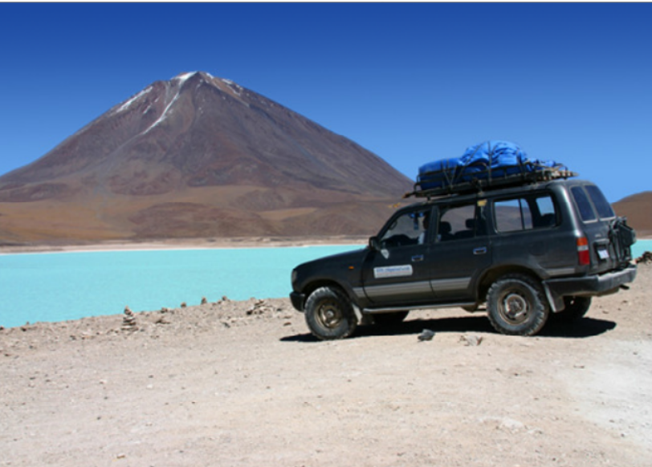

# Image-Completion-with-Structure-Propagation
Image Completion with Structure Completion. Implementation of paper *Sun, L. Yuan, J. Jia, and H.Y. Shum. Image completion with structure propagation. In ACM SIGGRAPH 2005 Papers, ACM, 2005. page 868*
https://dl.acm.org/doi/10.1145/1073204.1073274

| Original                                                    | Line                                                   | Structure                                                  | Results                                                   |
| ------------------------------------------------------------ | ------------------------------------------------------------ | ------------------------------------------------------------ | ------------------------------------------------------------ |
|  |  |  |  |
|  |  |  |  |
|  |  |  |   |
|  |  |  |  |
|  |  |  |  |
|  |  |  |  |